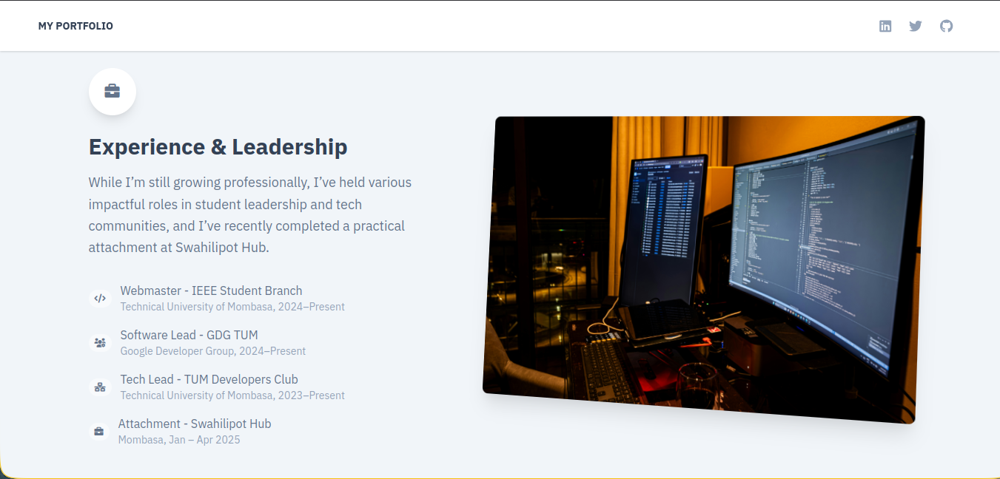

# 🧑‍💻 Ian's Personal Portfolio Website

Welcome to my **Personal Portfolio Website**! Built using **Next.js**, **JavaScript**, and **Tailwind CSS**, this site showcases my journey, skills, and the work I've been passionate about as a **Software Developer** and **Cybersecurity**.

 <!-- Optional image preview -->

---

## 🌐 Live Site

👉 [View Live](https://ianmuriuki.vercel.app)

---

## 📁 Tech Stack

| Technology        | Description                            |
| ----------------- | -------------------------------------- |
| **Next.js**       | React framework for SSR & static pages |
| **JavaScript**    | Primary scripting language             |
| **Tailwind CSS**  | Utility-first CSS for styling          |
| **Node.js** (API) | Backend for handling form submissions  |
| **Nodemailer**    | Sending contact emails                 |

---

## 📌 Features

- ✅ **Responsive Design** – Fully mobile & desktop friendly
- ✅ **Smooth Navigation** – Scroll-based section linking
- ✅ **Animated UI Elements** – Subtle transitions using Tailwind
- ✅ **Contact Form** – Integrated with Next.js API and Nodemailer
- ✅ **SEO Optimized** – Meta tags and clean URL structure
- ✅ **Deployed on Vercel** 

---

## 🧠 Sections Included

### 1. 👤 About Me

A short introduction outlining who I am, my background, and my developer journey.

### 2. 🧰 Skills

A clean, visual display of my top skills in:

- JavaScript / TypeScript
- Next.js / React
- Tailwind CSS / Bootstrap
- Node.js / Express
- MongoDB / SQL
- Cybersecurity principles
- Git / GitHub / CI-CD

### 3. 💼 Projects

A gallery of my featured projects with:

- Project images or GIFs
- Live demo links
- GitHub source code links
- Tech stack used

### 4. 📚 Education

Details of my academic background:

- Degree: Bachelor of Science in Information Technology
- University: Technical University of Mombasa
- Certifications: (ICP, Rust, Web3, etc.)

### 5. 💼 Experience

Relevant work experience and internships:

- Frontend Developer @ [Company]
- Cybersecurity Lead @ GDSC - TUM
- Open-source Contributor

### 6. 📞 Contact

An interactive contact form connected to a backend using Nodemailer to send messages directly to my email.

---

## 🚀 Getting Started

### 1. Clone the repo

```bash
git clone https://github.com/ianmuriuki/portfolio.git
cd portfolio


##File structure

portfolio
.
├── README.md
├── assets
│   ├── img
│   │   ├── brand
│   │   │   └── favicon.ico
│   │   ├── github.svg
│   │   └── google.svg
│   └── styles
│   ├── index.css
│   └── tailwind.css
├── components
│   ├── Dropdowns
│   │   ├── IndexDropdown.js
│   ├── Footers
│   │   ├── Footer.js
│   ├── Navbars
│   │   └── IndexNavbar.js
│   ├── PageChange
│   │   └── PageChange.js
├── next.config.js
├── package.json
├── pages
│   ├── 404.js
│   ├── \_app.js
│   ├── \_document.js
│   ├── \_error.js
│   ├── index.js
└── tailwind.config.js

```

```
